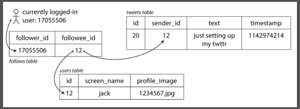
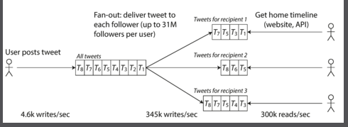

- [1. Reliable, scalable, and maintainable applications](#1-reliable-scalable-and-maintainable-applications)
  - [1.1. Reliability](#11-reliability)
    - [1.1.1. Hardware faults](#111-hardware-faults)
    - [1.1.2. Software errors](#112-software-errors)
    - [1.1.3. Human errors](#113-human-errors)
    - [1.1.4. How important is reliability](#114-how-important-is-reliability)
  - [1.2. Scalability](#12-scalability)
    - [1.2.1. Describing load](#121-describing-load)
    - [1.2.2. Describing performance](#122-describing-performance)
    - [1.2.3. Approaches for coping with load](#123-approaches-for-coping-with-load)
  - [1.3. Maintainability](#13-maintainability)
    - [1.3.1. Operability: making life easy for operations](#131-operability-making-life-easy-for-operations)
    - [1.3.2. Simplicity](#132-simplicity)
    - [1.3.3. Evolvability: Making change easy](#133-evolvability-making-change-easy)

---

# 1. Reliable, scalable, and maintainable applications

- Data-intensive vs compute-intensive: Former means the primary challenge is quantity/complexity of data, or the speed at which it is changing as opposed to being bottlenecked by cpu cycles.
- **Reliability** : The system should continue to work correctly (peforming the correct function at the desired level of performance) even in the face of adversity (hardware of software faults, and even human error).
- **Scalability**: As the system grows (in data volume, traffic colume, or complexity), there should be reasonable ways of dealing with that growth.
- **Maintainability**: Over time, many different people will work on the system (engineering and operations, both maintaining correct behavior and adapting the system to new use cases), and they should be able to work on it productively.

## 1.1. Reliability

- Faults - things that can go wrong.
- Fault-tolerant or resilient - systems that anticipate faults and can cope with them.
- It's not feasible to tolerate all types of faults.
- Fault is when one component of the system deviating from its spec, whereas a failure is when the system as a whole stops providing the required service to the user. (failure of a subsystem could be fault in the system).
- Impossible to have 0 faults. So prevent faults from causing failures, build reliable systems from unreliable parts.
- Chaos engineering - test fault-tolerance mechanisms of the system by deliberately inducing faults.

### 1.1.1. Hardware faults

- eg: hard disk crash, power grid has a blackout etc.
- Adding hardware redundancy, like RAID for disks, diesel generators etc.
  - Not a silver bullet, especially in recent times - more machines => increased rate of hardware faults.
  - Cloud providers have vms that can go offline without warning.
- Moving towards software fault-tolerance techniques
  - Tolerate loss of entire machines
  - Allows deployments without downtime (rolling upgrade)

### 1.1.2. Software errors

- Hardware faults are random, and independent for most part.
- Software errors are usually correlated across nodes and tend to cause more system failures. Examples:
  - Leap second issues
  - Process hogging up cpu/mem/disk/network resources on system
  - Core service fails
  - Cascading failures
- Validating assumptions, Testing, process isolation, crash & restart, measure, monitor systems.

### 1.1.3. Human errors

- Human operators are also an unreliable component of the overall system.
- Solutions to guard against this include:
  - Design good apis, abstractions and interfaces to increase understandability of the system, make it easier to use the system in the right way and make it harder to use it in the wrong way.
  - Non prod Sandbox environments, with real data, without affecting actual users.
  - Thorough tests - unit to integration, and manual to guard against corner cases.
  - Allow ways to minimize impact - feature flags, canaries, rollbacks, tools to recompute data in case old computation turns out incorrect.
  - Good telemetry to capture perf metrics and error rates.

### 1.1.4. How important is reliability

- Financial costs, damage to reputation
- Ethical responsibility to users
- Can be traded off against develpment cost, or operational cost, when required.

## 1.2. Scalability

- The ability to cope with increased load - this can be along different dimensions (increasing users, more data volume etc)

### 1.2.1. Describing load

- Load parameters:
  - Choice of load parameters depend upon the architecture of the system. Examples: requests per second in a webserver, ratio of reads to writes in a database, number of simultaneously active users in a chat room, hit rate of a cache, etc.
- Twitter example

  - Need to support post tweet, and home timeline operations.
  - Scaling challenge is not due to tweet volume, but due to fan-out - each user follows many people and each user is followed by many people.
  - 2 ways of doing it, and the hybrid approach.

    - Posting a tweet simply inserts the new tweet into a global collection of tweets. When a user requests their home timeliine, look up all the people they follow, find all the tweets for each of those users, and merge them (sorted by time).

      

    - Maintain a cache for each user's timeliine. When a user posts a tweet, look up all the people who follow that user, and insert the new tweet into each of their home timeline caches.

      

  - Initially twitter used first approach, later they used second approach. The reason the second approach is better is because home timeline is much more frequent (2 orders of magnitude) than post tweet. One downside of 2nd approach is that posting a tweet requires a lot of extra work, especially for celebrity accounts with huge number of followers (some users have 30m followers). So a hybrid approach is considered where for celebrity accounts only, the publish does not trigger cache write but is separately computed at load time whenever a follower requests a home timeline load.

### 1.2.2. Describing performance

- Investigate what happens when load increases:
  - when a load parameter is increased, keeping system resources unchanged, how is performance affected.
  - when a load parameter is increased, how much do you need to increase the resources in order to keep performance unchanged.
- Throughput and response time
- Distribution of values. Outliers can be due to more processing required for the request itself or due to external factors (like page faults, context switch, gc pause etc.)
- Percentiles are better than means for quantifying typical response time.
- Tail latencies - higher percentiles - p95, p99, p999 etc - of resp times are important for user experience (eg: amazon considers only p999 time)
- SLO - Service Level Objective
- SLA - Service Level Agreement
- Queueing delays account for large part of resp time at high percentile, due to head of line blocking so measure resp times on the client side, not on the server
- Load generating client needs to keep sending requests independencly of the response time. If the client waits for the prev req to complete before sending next, the effect is of artificially keeping queues shorter in the test than in reality.
- High percentiles are more important for backend service dependencies that are called multiple times as part of serving a single end user request.
- Approximation algorithms to compute running percentiles efficiently - forward decay, t-digest, hdrhistogram (TODO: ???)

### 1.2.3. Approaches for coping with load

- Architecture is specific to load. It is likely that you'll need to think about rethink architecture on every order of magnitude load increase
- Good architectures include a hybrid of both scaling up (vertical scaling) and scaling out (horizontal scaling)
- Elasticity is the property of a system to add computing resources in response to increasing load, and remove them as the load decreases. But manual scaling is better if the load is predictable since it's simpler and has less operational surprises.
- Distributing stateful services is harder than for stateless services but it's increasingly becoming more common due to availability requirements or scaling cost for vertical scaling.
- There is nothing like a one-size-fits-all scaling architecture (_magic scaling sauce_). The architecture is highly specific to the application itself.

> An architecture that scales well for a particular application is built around assumptions of which operations will be common and which will be rare—the load parameters. If those assumptions turn out to be wrong, the engineering effort for scaling is at best wasted, and at worst counterproductive. In an early-stage startup or an unproven product it’s usually more important to be able to iterate quickly on product features than it is to scale to some hypothetical future load.

## 1.3. Maintainability

- Majority of cost of software not in initial development, but in ongoing maintenance. 3 design principles for maintainability:
  - Operability - make it easy for operations teams to keep the system running smoothly.
  - Simplicity - make it easy for new engineers to understand the system, by removing as much complexity as possible from the system
  - Evolvability - make it easy for engineers to make changes to the system in the future, adapting it for unanticipated use cases as requirements change. Also known as extensibility, modifiability or plasticity.

### 1.3.1. Operability: making life easy for operations

- Good operability means making routine tasks easy, allowing ops team to focus theur efforts on high-value activities (reduce toil).
- Some examples include increased visibility into runtime behavior, providing support for automation with standard tools, provide support for rolling upgrades, provide good docs and easy to understand operational model, good default behavior but also allow overriding, self healing with overrides, predictable behavior with less surprises.

### 1.3.2. Simplicity

- As projects become larger, they become very complex and difficult to understand, slowing down everyone who needs to work on the system and increasing the cost of maintenance. Such project called _Big ball of mud_.
- Making a system simpler does not necessarily mean reducing functionality. It can also mean removing _accidental complexity_ (complexity that is not inherent in the problem that the software solves but arises only from the implementation).
- _Abstraction_ is one of the best tools for removing accidental complexity. Good abstractions hide a lot of implementation detail and make the system simpler. Also same abstraction can be reused in different problems.A Good abstractions are hard to find.

### 1.3.3. Evolvability: Making change easy

- System requirements change as previous unanticipated use cases emerge, business priorities change, users request new features, new platforms replace old platforms, legal or regulatory requirements,, growth of the system forces architectural changes etc.
- _Agile_ working paterns provide a framework for adapting to change. Agility at the scale of large data systems is referred to as _evolvability_.

---

# 2. Data Models and Query Languages

Data model have a high impact, not only on how the software is written but also on how we thing about it.  
Multiple layers of data models - abstractions  
preconditions & postconditions - assumptions & guarantees - from lower layer to upper layer  
exploration of a few data models - relational, document, graph based  
also some query languages and comparison of their use cases.

## 2.1. Relational Model Versus Document Model 

Relations/tables, tuples/records/rows  
60s & 70s - why relational won at that time, and the goal of the relational model  
network model & hierarchical model in 1980s  
object databases in 1980s & early 90s  
xml databases in early 2000s - niche adoption  
relational model generalized very well - most widely used model currently.

### 2.1.1. The Birth of NoSQL
driving forces
- Need for greater scalability, larger datasets, higher throughput
- Preference for FOSS over commercial database
- Specialized query operations, not well supported by relational
- More dynamic expressive schema as opposed to restrictive schema of relational
polyglot persistence  

### 2.1.2. The Object-Relational Mismatch

what is OR mismatch  
object relational mapping  
locality in the document schema

### 2.1.3. Many-to-One and Many-to-Many Relationships

### 2.1.4. Are document databases repeating history

### 2.1.5. Relational Versus Document Databases Today

## 2.2. Query Languages for Data

### 2.2.1. Declarative Queries on the Web

### 2.2.2. MapReduce Querying

## 2.3. Graph-Like Data Models

